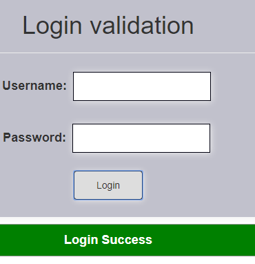
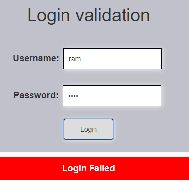

# Login-validation

Login validation using json data. If username and password are matching with json data then only it shows success message otherwise it shows error message.  

## Using the complete angular project
Download the login-validation folder and install the required packages and run the application.

### Installing

```
 >npm install
```
### Run server

```
>ng serve
```

### JSON data format is:

```
jsonData = [{
    "name": "john",
    "pwd": "123",
  },
  ------
  ]
```

### JSON Description:

```
name:Username,

pwd:User Password.
```

## STEPS:

Initially the component looks like this:  

<p align="center"></p>

Enter username and password in given input boxes, if the given password is less than three characters then login button is in disabled.
 
<p align="center"></p>

 If the given values are matched with JSON data then it shows success message.

<p align="center"></p>

 If the given values are not matched with as JSON data then it shows error message.
 
<p align="center"></p>


## @Input Decorator:

 ```typescript
 @Input("jsonData") jsonData;
 ```
 
 JSON data is used for user authentication i.e verifying username and password.

Plesae check Demo URL of this component: [click here](https://angular-5fvv5g-1tnvqt.stackblitz.io)
